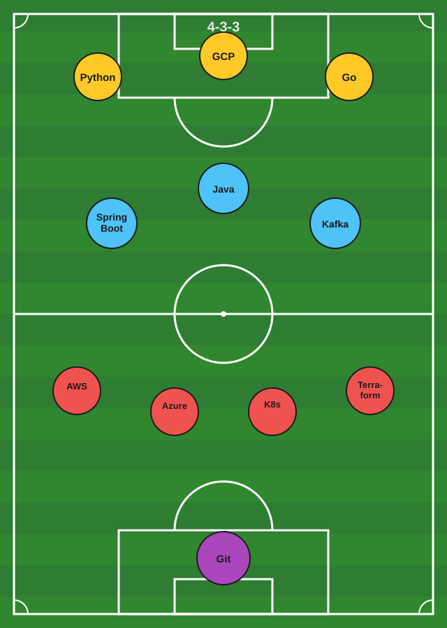

# Hi, I'm Prasad 👋

Solution Architect with 25+ years across software development, tooling, and cloud architecture. Currently building event-driven systems and authentication tech.

## Skills

## Starting XI

My stack, lined up in a 4-3-3. Attack up top with Python, GCP, and Go. Java, Spring Boot, and Kafka run the midfield. AWS, Azure, Kubernetes, and Terraform hold the back line. Git in goal, because nothing gets past version control.

## GitHub Stats

